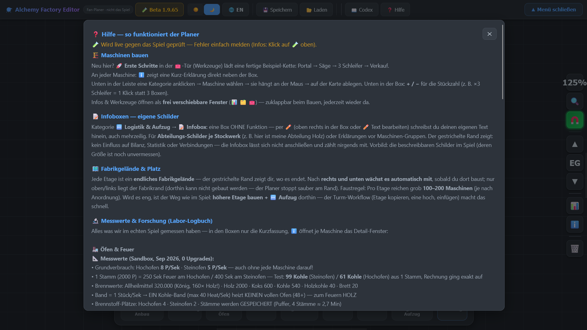
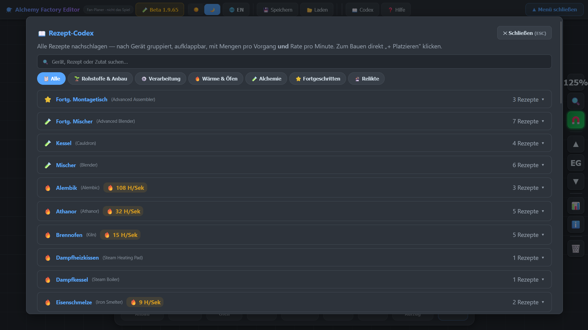
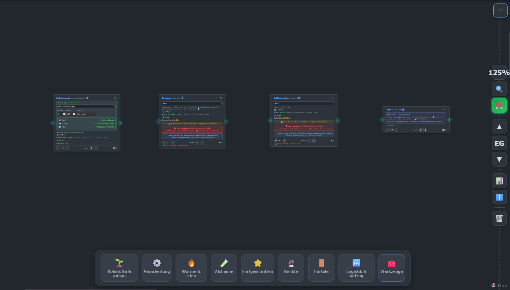
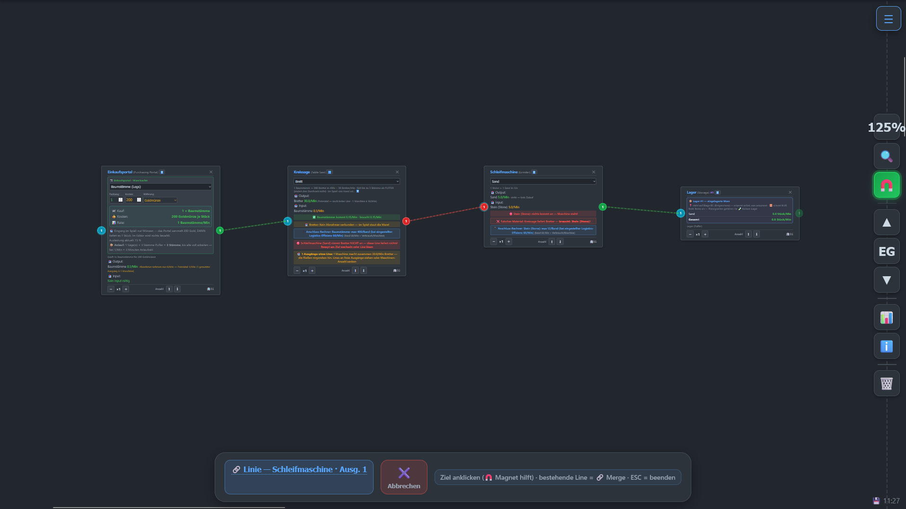
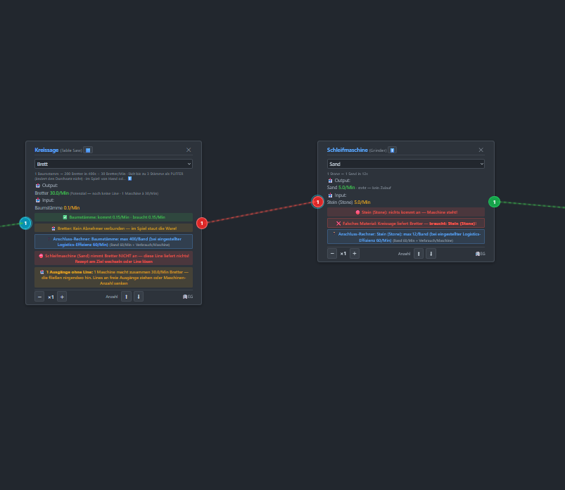
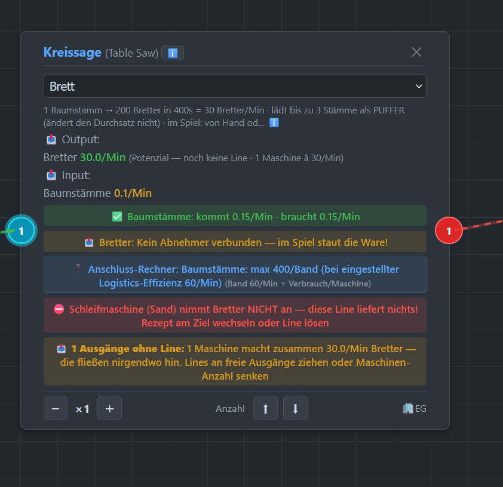
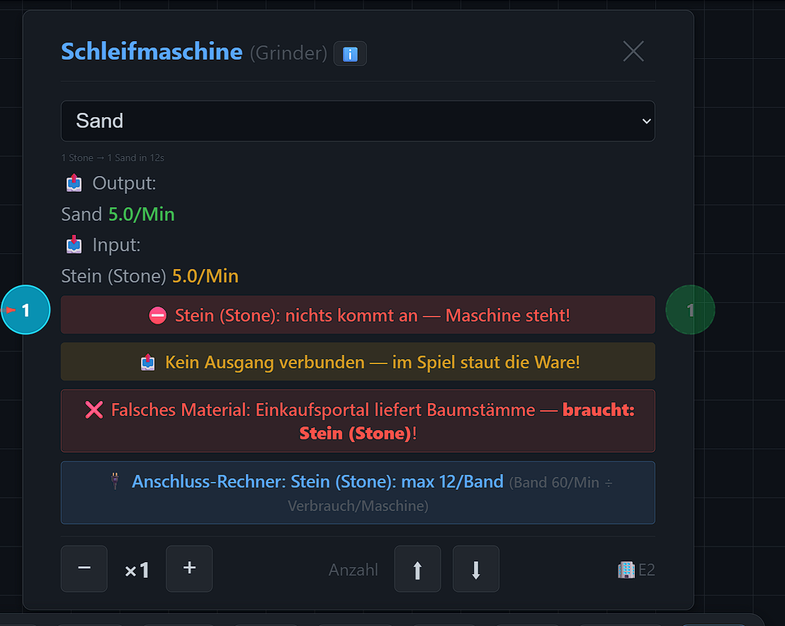
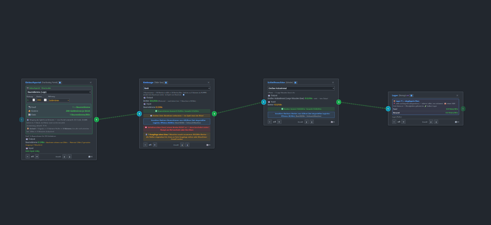

**Die Live-Vorschau**
**The live preview**
---
**Dark Background**

**White Background**
 
---
---
**MENU**
 
---
 
---
 
---
 
---
 
---
 
---
 
---
 
---
 
---
**The Help Menu**
 
---
**The Codex Menu**
 
---
**The first Setup**
 
---
**Connecting the Lines - is there a "Red line" error?**
 
---
**There is an error here.**
 
---
**The “CIRCLE SAGE” is not it**
 
---
**It's "The Grinder"**
- "SAND" is selected in the settings, but "Boards" are being delivered.

 
---
**Let's switch to "Big Wooden Gear",** and all Lines are Green
 
---

